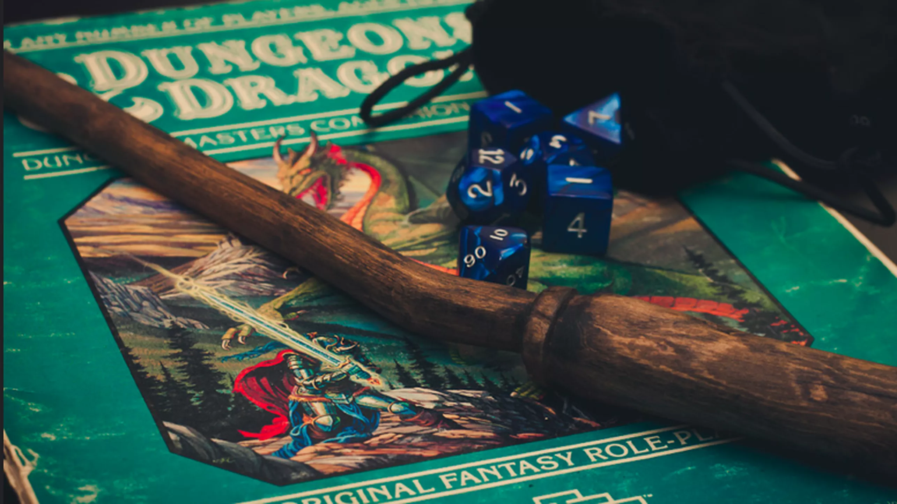

# Contrato social de tabletop RPG

Versión 0.1.0

Mayo de 2022

> Este documento está en constante cambio, asi que si querés ver la versión más actualizada fijate en [github.com/AucaCoyan/rpg-social-contract](http://www.github.com/AucaCoyan/rpg-social-contract) <!-- , se puede ver el CHANGELOG [acá]() (broken link). -->

Juntarse a jugar rol es un compromiso que lleva mucho tiempo, organización y esfuerzo de todas las personas. Este README.md trata de asentar unos lineamientos para compartir momentos de la manera más disfrutable posible, en un ambiente de respeto y entendimiento.

<!--
### Resumen de contenidos:
TODO
-->

Este texto sirve como marco general para todas mis campañas. Tener en cuenta que para alguna campaña particular puede que apliquen algunas reglas especificas.

👇 Hay más info dentro de los triangulitos!

Roll for initiative!
<blockquote>
You rolled a nat 1.

## Antes de empezar a jugar

**

no faltes o llegues tarde
**

<blockquote>
Antes de empezar a jugar, tenemos que tener en cuenta que nos juntamos a jugar con compromiso, el GM probablemente estuvo varias horas leyendo el libro, preparando contenido como mapas y monstruos, configurando y copiando texto al VTT mientras está pensando en su tiempo fuera de la pc cómo es la mejor forma de llevar adelante la aventura. Por favor, respetá el esfuerzo de los demas con el compromiso de llegar puntual a las sesiones y tratar de no faltar.
Vos pensá que si falta un jugador los ponés a los demás en una situación de compromiso, porque no estaría bueno que la historia avance sin un jugador, pero mientras tanto qué pueden hacer?.
</blockquote>

**

todos tenemos un calendario ocupado
**

<blockquote>
Todos tenemos una vida apretada por el trabajo y otros hobbies que mantenemos o tiempo libre que tenemos para nosotros. Coordinar a 4 o más personas hoy es muy ajetreado, este es un motivo más de por qué tratemos de no faltar o cancelar las sesiones, porque muchas veces cuando se cancela no podemos jugar hasta la semana que viene, y pasamos 15 (o más) días sin jugar el juego de mesa que nos gusta 😢. Es de buena onda cuando avisás que cancelas proponer enseguida una fecha para remediar en la semana.
</blockquote>

**

evaluá si podés asistir durante toda la campaña
**

<blockquote>
Por último, a veces tenemos un montón de ganas de jugar una aventura, pero después pasa que nunca encontramos el horario con el grupo, o dormimos mal por 6 meses un dia a la semana poruqe nos comprometimos a jugar a las 12 de la noche.
Tengamos en cuenta eso, no te sumes a una campaña para la cual no podés asegurar estar en todas las sesiones
</blockquote>

**

avisá** **con tiempo** **si vas a llegar tarde o faltar
**

<blockquote>
Le doy importancia a la puntualidad, asi que si te ocurre algun problema antes de la sesión y tenés que llegar un poco tarde, por favor avisá en el canal de comunicacion que tengamos en el grupo (no solo al GM! 😉).
Se considera que se espera 15 minutos. Si llegas un minuto después no significa que te quedes afuera de la campaña, pero tratá de tener una buena razón si no avisaste que llegas tarde antes (no digamos 
"porque colgué, equis de").
</blockquote>

**

Si falta un jugador, el GM puede cancelar la partida
**

<blockquote>
Si esperamos a un jugador y no viene, después de que el GM considere que la espera fue suficiente se cancela la partida, así no estamos todos comprometidos con algo fijo como jugar rol (sin realmente estar jugando rol) y podemos hacer otra cosa si queremos.

A veces podemos jugar con un jugador menos, pero tratamos de que no sea relevante para la historia (así aprovechamos la juntada). Una de las cosas más dificiles de conseguir es gente para jugar en un horario que puedan todos.

</blockquote>

**

Si te tenés que ausentar por más tiempo, se puede charlar
**

<blockquote>
Si tenés la necesidad de dejar de jugar por varias semanas, por favor charlá con el GM para ver como podemos entrelazar con la campaña, asi no se esfuma de la historia y mágicamente aparece unas sesiones más tarde.
</blockquote>

## Background del personaje

**

Tratá de esforzarte en background de tu personaje
**

<blockquote>

Jugamos al rol por varios motivos, por entretenimiento, por leer buenas historias, por interpretar personajes que queremos y escaparnos de la realidad, por el lado gaming de "derrotar" los obstáculos del camino y tambien por el encuentro social [ver éste video](https://www.youtube.com/watch?v=UrIIeC-ahf8) que habla más sobre el tema.

La historia la considero una gran parte, y para que la historia sea de los personajes, necesito de tu ayuda para que me indiques de donde viene, qué está haciendo y hacia adonde va tu personaje. Se agradecen los documentos! (_por ejemplo google docs_ 🧠)

</blockquote>

**

It's cool to flavour your PC
**

<blockquote>

Con acuerdo del GM, podés rediseñar todo lo que se te antoje de tu personaje, cambiar descripciones de hechizos, animal companions, algunos dotes y tener items personalizados pero es solo es con el objetivo de una mejor interpretacion. No se cambiarán las mecánicas a tu favor porque vos lo pidas.

</blockquote>

### Jugando en la sesión

**

Tratemos de cuidar los oidos de los demás y no dejar el microfono encendido si hay ruidos molestos. Nuestros oidos te lo van a agradecer!
**

Además, si acompañás poniendo música, sonidos, pegando imagnes en el canal, haciendo memes durante la semana y demás la pasamos todos mejor 😄

**

Por mucho que lo quieras, tu PJ se puede morir
**

<blockquote>

La muerte de los personajes es indeseada, pero puede ocurrir.

El mundo de fantasía no está vacío de peligros, y si los personajes fueran actores de una serie que tiene que seguir sería medio aburrido que siempre salgan victoriosos no importan las condiciones. Por supuesto que no voy a ponerme en modo hardcore, pero las acciones tienen consecuencias.

Ante la muerte de un personaje, siempre se charla con el GM qué hacer después.

</blockquote>

- Solamente controlas a tu personaje. No controlás los personajes de los demás, salvo autorización del GM. (por ejemplo cuando falta un jugador).

Software que solemos usar:
Generalmente uso siempre Foundry, es cómodo y no requiere nada más que un navegador, asi que está piola

Usamos estas safety tools

- asd

### Player Behavior and Discipline

## dont be a dick

- Cumplir los terminos de usuario de discord

Erotic roleplaying (ERP) and crimes of an exceedingly violent or sexual nature are forbidden from being performed. If you're not sure if something you're doing qualifies here, do not post it.

No se permite luchar jugador contra jugador (PvP)

> # Forbidden Actions

>
> Forbidden Actions are those you cannot take in-character, for any reason. If your proposed action has something to do with the actions described below and you start your sentence with, "what if?" or similar wording to produce the same effect, you are wrong. If you falsely accuse someone of such acts, or if you try to claim them in a manner seen to troll or manipulate a situation, you will be punished as if you had committed them yourself. You can read further about this in Player Behavior and Discipline.

> These subjects exist in the world just like in our own, but the point is that they are not described nor depicted for the sake of all of our player's and DM's peace of mind.

- Sexual Assault

You may not attempt to sexually assault another character, ever. It does not matter if the players involved are fine with it, they and you will not participate in it. If it is done privately, do not reference it in public or use it in any way to impact other characters. With player permission, less egregious acts may be performed, such as a classy touch, hand grab, shoulder rub, etc. Romance and pursuing it is fine, but groping is where the line is drawn.

- Torture

You may not torture another character, player or NPC. This includes but is not limited to physical, mental, or spiritual torture. Social interrogation and general trickery of a less extreme nature are permissible.

- Child Death

You may not harm a true child, ever. Disasters, NPC enemies, sickness, and such dangers exist, but their use for the narrative is handled solely, and strictly, by the DMs.

- Suicide

Players may not kill their characters through suicide. They cannot threaten to do so, they can not say they will do so. If your character would get to the point they will, then retire. Retiring in this way is not a substitute for death. No suicide. Heroic self sacrifice does not fall under this forbidden action.

- Maltrato animal

Los michis son eternos.

- Phobias

  This one is not as serious as the other four, but you must still adhere to good practice when utilizing these. If you roleplay a character that contains heavy symbology, reference or intensity with a common phobia, it is best to warn the players present so that they can look away or remove themselves. As long as some form of communication is attempted and none involved are trying to control the actions of others with this rule, then it is fair play. Any attempt to metagame this rule for a mechanical or roleplay advantage, or to exploit a player, will result in your removal.

  Examples of common phobias:

  - Arachnophobia (spiders)
  - Aerophobia (flying)
  - Trypophobia (clusters of holes)
  - Ophidiophobia (snakes)
  - Cynophobia (dogs)
  - Thalassophobia (deep water)
  - Trypanophobia (needles)
  - Coulrophobia (clowns)

### Metagaming

Leer el modulo de aventuras

> Metagaming is when a player uses their out-of-character knowledge to determine their character's actions, even though the character has no relevant knowledge or awareness of its details. There are different levels of severity to metagaming, some of it harmless, but it is inevitable to happen one way or another. The best we can do is mitigate it and the consequences.

> So, do not have your character act in a way that is not consistent with the character's established persona or their knowledge. It's as simple as that.

### Informacion secreta

Tiradas ocultas, y eso

### Contenido Homebrew

El GM dice qué libros oficiales son validos (APG, Secrets of Magic, etc)
Además, todo contenido extraoficial (homebrew) queda afuera salvo que el GM lo incluya particularmente.

### Minmaxing y Munchkin

ya me paso en el pasado, la mejor de las ondas con el jugador, pero es un pain in the butt.
Es subjetivo
Ejemplos

<!--
Dudas:
* Que onda las facciones?
* Lore?
* como explico el ambiente o lo que esta bien o mal en una campaña?
--->

<!--
# Content yet to filter:

-->

# Videos que estann buenos para ver:

dont be that player
5 levels of players
5 levels of gms
we are all players, the GM too!
Todos contribuimos a la historia
